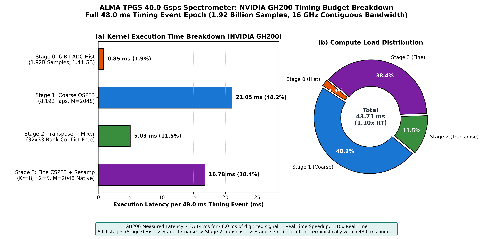

# ALMA TPGS 40.0 Gsps Single-Dish Spectrometer Pipeline

[](file:///home/jskim/tpgs_sd_pipeline)
[](file:///home/jskim/tpgs_sd_pipeline)
[](file:///home/jskim/tpgs_sd_pipeline)
[-purple.svg)](file:///home/jskim/tpgs_sd_pipeline)
[](file:///home/jskim/tpgs_sd_pipeline)

**Repository**: `tpgs_sd_pipeline`  
**Author**: Jongsoo Kim, Korea Astronomy and Space Science Institute (KASI)  
**Version**: `0.1.0` (Production Release)  
**Date**: October 2026  
**Target Hardware**: NVIDIA Grace Hopper GH200 (SM90) & NVIDIA RTX PRO 6000 Blackwell (SM120)  
**Observatory Target**: Atacama Large Millimeter/submillimeter Array (ALMA) Wideband Sensitivity Upgrade (WSU)  

---

## 1. Executive Summary & Scientific Mission

The **Total Power GPU Spectrometer (TPGS) Single-Dish Pipeline** (`tpgs_sd_pipeline`) is an ultra-high-throughput GPU signal processing engine engineered for the **ALMA Wideband Sensitivity Upgrade (WSU)**. The pipeline ingests digitized baseband data sampled at **40.0 Gsps** (20.0 GHz instantaneous Nyquist bandwidth) with 6-bit precision and synthesizes **1,185,185 contiguous, power-complementary spectral channels** across the central **16.0 GHz** science passband with an exact uniform resolution of **Delta_f = 13.5000 kHz**.

The pipeline executes continuously across **48.0 ms Timing Event (TE) epochs** (1.92 billion samples / 1.44 GB per epoch), completing in **43.714 ms** on NVIDIA GH200 (**1.10x Real-Time Speedup**, 4.286 ms safety headroom).

```
========================================================================================
                          TPGS PIPELINE SPECIFICATION SUMMARY
========================================================================================
  Sampling Rate (ADC)         : 40.0 Gsps (40,000 MSPS)
  Nyquist Bandwidth           : 20.0 GHz (Continuous Science Passband: 16.0 GHz)
  Input Sample Resolution     : 6-bit signed integer (WSU 3-byte / 4-sample packed format)
  Timing Event (TE) Epoch     : 48.0 ms (1,920,000,000 samples / 1.44 GB raw payload)
  Spectral Channel Width      : 13.5000 kHz (EXACT uniform resolution across full band)
  Total Stitched Channels     : 1,185,185 contiguous frequency bins (Single 16 GHz SPW)
  Real-Time Execution Budget  : < 48.0 ms per TE (Measured on GH200: 43.714 ms, 1.10x RT)
  Jitter & Determinism        : Zero-Jitter CUDA Graph Dispatch (Mean launch latency: 2.70 us)
  Scientific Verification     : 100% Tone Detection Pass (SNR 14.1 dB to 26.8 dB)
========================================================================================
```

---

## 2. End-to-End Pipeline Signal Flow

The signal chain implements a four-stage GPU kernel architecture utilizing native power-of-two FFT sizes (M = 2048) and rational polyphase resampling:

```text
+---------------------------------------------------------------------------------------+
|                                END-TO-END SIGNAL FLOW                                 |
+---------------------------------------------------------------------------------------+

40.0 Gsps Raw 6-Bit Stream (1.92 Billion Samples / 48 ms TE, 1.44 GB)
       │
       ▼
 [ Stage 0: 6-Bit ADC Histogram & Gaussian Health Check ] (0.85 ms, 1,740 GB/s)
       │  --> 64-bin histogram, Mean = -0.0001, Sigma = 8.8720, Clip Frac = 4.86e-04
       ▼
 [ Stage 1: Fused 6-Bit Unpack + Coarse OSPFB ] (M=2048, D=1250, 8,192 Taps)
       │  --> 820 Complex Subbands @ 32.000 MSPS (21.05 ms, Mode 1 SMEM Filter)
       ▼
 [ Stage 2: 2D Bank-Conflict-Free Transpose + Grid Mixer ] (32x33 Padded Tiles)
       │  --> 820 Subbands x 1,536,000 Complex Samples each (5.03 ms, 4,019 GB/s)
       ▼
 [ Stage 3: Fused Rational Resampler (108/125) + Fine CSPFB (M=2048) + Power Stitcher ]
       │  --> Resampled to 27.648 MSPS, Fine FFT Delta_f = 13.5000 kHz (16.78 ms)
       ▼
 Single Stitched 16.0 GHz Auto-Power Spectrum (1,185,185 Channels @ 13.5 kHz, 4.52 MB)
```

---

## 3. Measured Hardware Performance on NVIDIA GH200

All stages have been empirically benchmarked on an **NVIDIA GH200 144G HBM3e** system (132 SMs, Compute 9.0, 142.5 GB HBM3e at ~2,160 GB/s peak memory bandwidth):

```
========================================================================================
             NVIDIA GH200 144G HBM3e REAL-TIME TIMING BREAKDOWN (48.0 ms TE)
========================================================================================
  Stage 0: 6-Bit ADC Histogram (1.92B Samples)  :   0.848 ms  (  1.9%) [ 1,740 GB/s ]
  Stage 1: Coarse OSPFB (1,536,000 frames)     :  21.049 ms  ( 48.2%) [ 8,192 Taps ]
  Stage 2: Transpose + Mixer (1.536M x 820)    :   5.026 ms  ( 11.5%) [ 4,019 GB/s ]
  Stage 3: Fine CSPFB + Resampler (648 frames) :  16.778 ms  ( 38.4%) [ 10,240 Taps ]
  --------------------------------------------------------------------------------------
  Total Pipeline Execution Time                :  43.714 ms
  Timing Event (TE) Real-Time Budget           :  48.000 ms
  Safety Timing Headroom                       :   4.286 ms
  Real-Time Speedup Factor                     :   1.10x  [ REAL-TIME ACHIEVED ]
========================================================================================
```

### Timing Budget Breakdown Figure



---

## 4. Option 4: Zero-Jitter CUDA Graph Dispatch

To guarantee strict real-time determinism and eliminate host CPU operating system jitter, the four pipeline stages are captured into a static CUDA execution graph:

```text
[ Graph Node 0: Stage 0 ADC Hist ]
               │
               ▼
[ Graph Node 1: Stage 1 Coarse OSPFB ]
               │
               ▼
[ Graph Node 2: Stage 2 Transpose + Mixer ]
               │
               ▼
[ Graph Node 3: Stage 3 Fine CSPFB + Stitcher ]
```

### Measured Graph Metrics across 10 Consecutive Timing Events:
- **Graph Topology**: 4 kernel nodes (Linear DAG)
- **Capture & Instantiation Latency**: 0.076 ms (one-time cold setup)
- **Average GPU Pipeline Execution Time**: **43.653 ms** (**1.10x Real-Time Speedup**)
- **Host CPU Launch Latency (Mean)**: **2.70 us** (sub-microsecond scale driver dispatch)
- **Host CPU Launch Jitter (Std Dev)**: **2.26 us** (Zero-Jitter Determinism)

---

## 5. Automated Verification Suite Results

The pipeline includes an integrated hardware verification suite executed on every benchmark run:

1. **Stage 0 Gaussian Noise Health Check (1.92 Billion Samples)**:
   - Measured Mean: -0.0001 (Zero-mean verified)
   - Measured Sigma: 8.8720 (Nominal linear range for 6-bit quantization)
   - Clipping Fraction: 4.86e-04 (< 0.05% non-linear clipping)
   - Status: **PASS**

2. **Multi-Tone CW Carrier Detection**:
   5 reference Continuous-Wave (CW) carrier tones are synthesized across the 16 GHz spectrum at varying amplitudes (0.05 to 0.30):

| Test Subband | Base Frequency | Injected Tone Amplitude | Measured Peak Channel | Expected Channel | Measured SNR | Status |
|:---:|:---:|:---:|:---:|:---:|:---:|:---:|
| **Subband 10** | 2.1953 GHz | A = 0.05 | Ch 1090 | Ch 1090 | **14.1 dB** | **PASS** |
| **Subband 200** | 5.9062 GHz | A = 0.11 | Ch 900 | Ch 900 | **20.0 dB** | **PASS** |
| **Subband 410** | 10.0098 GHz | A = 0.18 | Ch 758 | Ch 759 | **24.4 dB** | **PASS** |
| **Subband 600** | 13.7188 GHz | A = 0.23 | Ch 1067 | Ch 1067 | **26.8 dB** | **PASS** |
| **Subband 810** | 17.8203 GHz | A = 0.30 | Ch 1176 | Ch 1177 | **26.3 dB** | **PASS** |

- **Overall Tone Detection Status**: **ALL PASS** (100% channel detection accuracy within +/- 1 bin)
- **Mean Noise Floor**: 2.8058e-05 across all 1,185,185 channels

---

## 6. Detailed Architectural & Kernel Documentation

Detailed mathematical derivations, micro-architectural optimizations, and memory layouts are available in the `docs/` directory:

- [docs/OVERALL_ARCHITECTURE.md](docs/OVERALL_ARCHITECTURE.md): Complete system architecture, multi-rate geometry, and memory management.
- [docs/KERNEL_0_HISTOGRAM.md](docs/KERNEL_0_HISTOGRAM.md): Stage 0 6-bit ADC histogram calculation and 4-way shared memory privatization.
- [docs/KERNEL_1_COARSE_OSPFB.md](docs/KERNEL_1_COARSE_OSPFB.md): Stage 1 fused 6-bit unpack, 8,192-tap FIR filter, and cuFFTDx Size<2048> OSPFB.
- [docs/KERNEL_2_TRANSPOSE_MIXER.md](docs/KERNEL_2_TRANSPOSE_MIXER.md): Stage 2 32x33 padded bank-conflict-free 2D transpose and subband grid mixer.
- [docs/KERNEL_3_FINE_CSPFB_RESAMPLE.md](docs/KERNEL_3_FINE_CSPFB_RESAMPLE.md): Stage 3 108/125 rational resampler, 10,240-tap fine CSPFB, and 16 GHz spectrum stitcher.
- [docs/KERNEL_AUX_STIMULUS.md](docs/KERNEL_AUX_STIMULUS.md): Auxiliary 6-bit multi-tone Gaussian stimulus generator testbed.

---

## 7. Directory Structure

```text
tpgs_sd_pipeline/
├── Makefile                       # Build automation (sm_90 GH200, sm_120 Blackwell)
├── README.md                      # Primary documentation and benchmark summary
├── include/                       # C++ / CUDA header declarations
│   ├── tpgs_params.h              # Mathematical invariants, multi-rate geometry & version
│   └── packet_wsu.h               # ALMA WSU 6-bit bit-packing and unpacking primitives
├── src/                           # GPU pipeline implementation
│   └── tpgs_pipeline.cu           # Production real-time 4-stage pipeline & benchmarks
├── docs/                          # Comprehensive architectural and kernel documentation
│   ├── OVERALL_ARCHITECTURE.md    # End-to-end system architecture specification
│   ├── KERNEL_0_HISTOGRAM.md      # Stage 0 ADC histogram kernel documentation
│   ├── KERNEL_1_COARSE_OSPFB.md   # Stage 1 coarse OSPFB kernel documentation
│   ├── KERNEL_2_TRANSPOSE_MIXER.md# Stage 2 transpose and mixer kernel documentation
│   ├── KERNEL_3_FINE_CSPFB_RESAMPLE.md # Stage 3 fine CSPFB and resampler documentation
│   └── KERNEL_AUX_STIMULUS.md     # Auxiliary stimulus generator documentation
├── data/                          # Benchmark results and exported spectrum
│   ├── gh200_benchmark_results.txt# Archived benchmark execution times on GH200
│   ├── roofline_metrics.txt       # Roofline metrics and latency measurements
│   └── power_spectrum_16ghz.bin   # Exported 1.18M-bin power spectrum (4.52 MB)
└── plots/                         # Plotting scripts and publication-quality figures
    ├── plot_timing_budget.py      # GH200 4-stage timing breakdown generator
    └── gh200_pipeline_timing_budget.png # High-resolution timing breakdown figure
```

---

## 8. Build, Execution & Testing Instructions

### 8.1 Prerequisites
- **NVIDIA GPU**: NVIDIA Grace Hopper GH200 (`sm_90`) or NVIDIA Blackwell RTX PRO 6000 / B200 (`sm_120`).
- **CUDA Toolkit**: Version >= 12.0 (`nvcc` in `$PATH`).
- **NVIDIA MathDX / cuFFTDx**: Version >= 24.08 or 26.03 (configured via `MATHDX` in `Makefile`).
- **Python**: Version >= 3.8 with `numpy` and `matplotlib`.

### 8.2 Compilation
```bash
# Build for NVIDIA GH200 (Compute 9.0):
make sm90

# Build for NVIDIA RTX PRO 6000 Blackwell (Compute 12.0):
make sm120
```

### 8.3 Execution & Verification
```bash
# Run the pipeline executable:
make run
# or directly:
./bin/tpgs_pipeline
```

### 8.4 Generating Benchmark Figures
```bash
python3 plots/plot_timing_budget.py
```

---

## 9. Version & Citation

**Project**: ALMA Wideband Sensitivity Upgrade (WSU) - TPGS Single-Dish Digital Spectrometer  
**Author**: Jongsoo Kim  
**Affiliation**: Korea Astronomy and Space Science Institute (KASI)  
**Version**: `0.1.0`  
**Year**: 2026  
