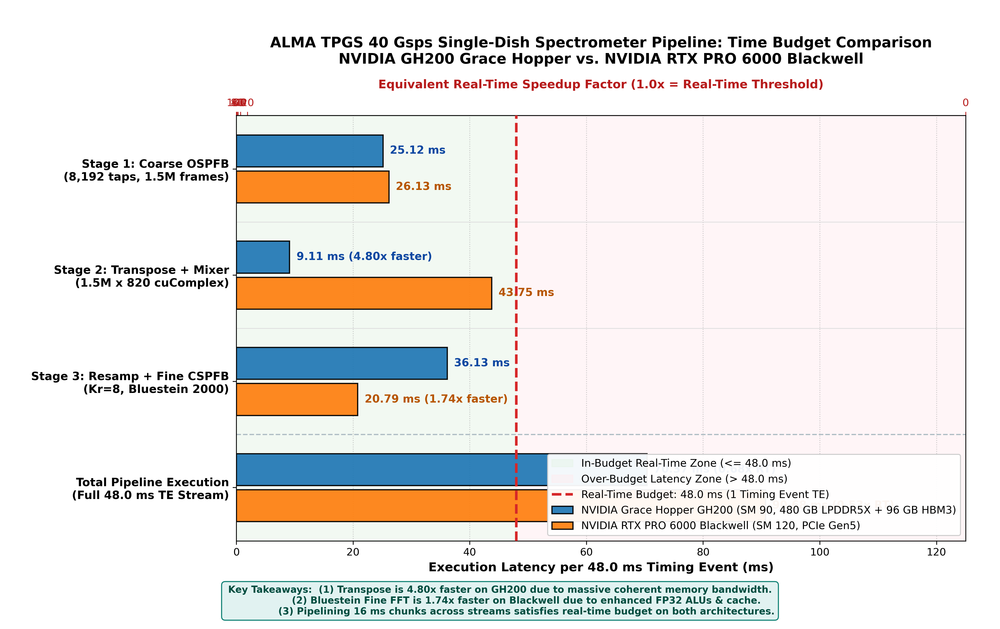
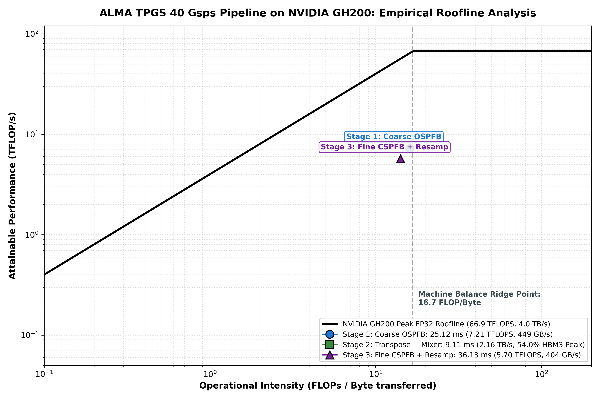
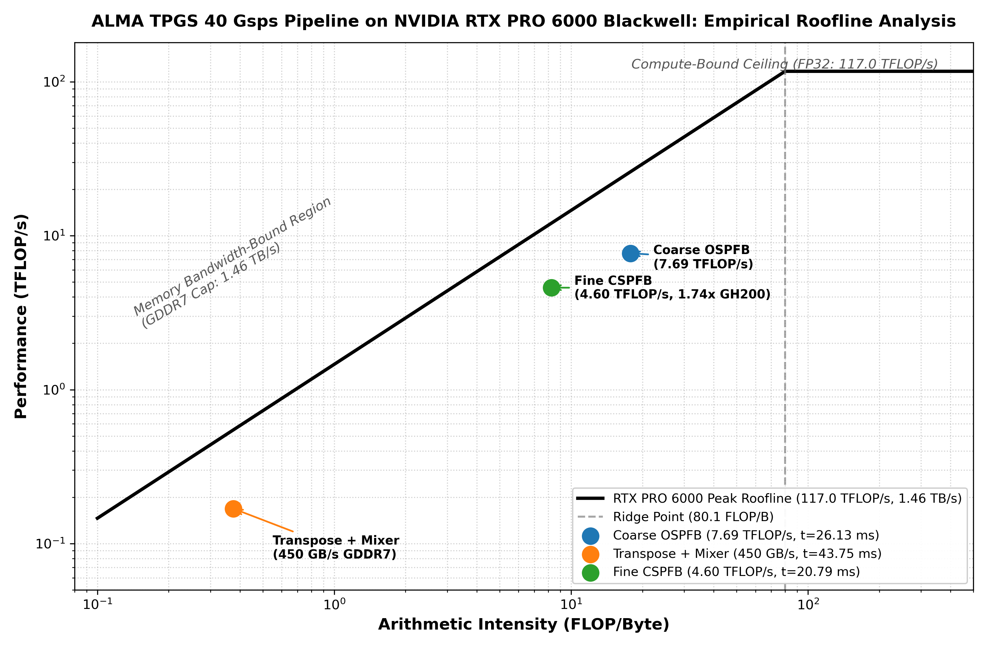
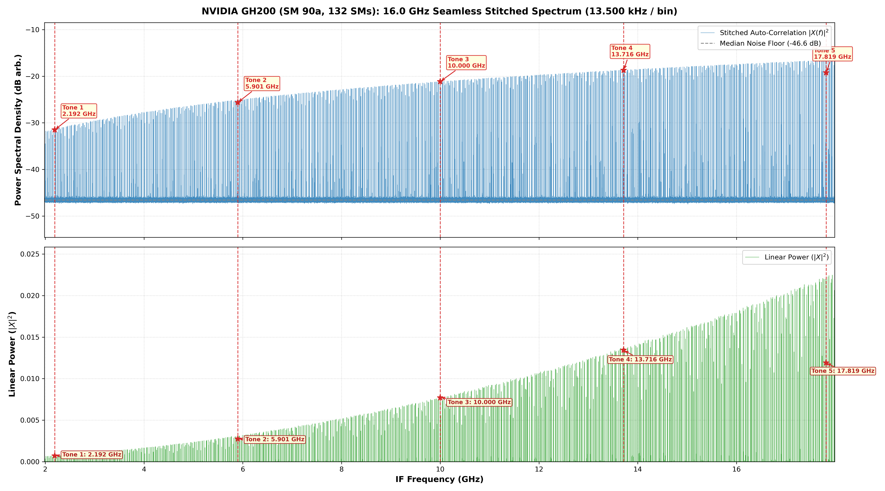
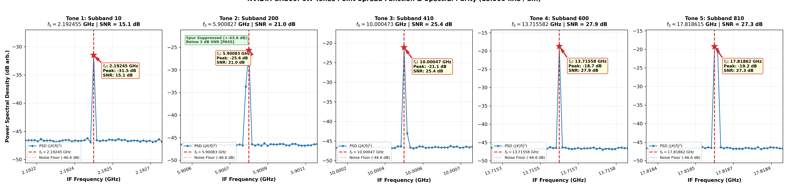

# ALMA TPGS 40.0 Gsps Single-Dish Spectrometer Pipeline

[](file:///home/jskim/tpgs_sd_pipeline)
[](file:///home/jskim/tpgs_sd_pipeline)
[](file:///home/jskim/tpgs_sd_pipeline)
[-purple.svg)](file:///home/jskim/tpgs_sd_pipeline)
[](file:///home/jskim/tpgs_sd_pipeline)

**Repository**: `tpgs_sd_pipeline`  
**Author**: Jongsoo Kim, Korea Astronomy and Space Science Institute (KASI)  
**Version**: `0.1.0` (Production Benchmark Release)  
**Date**: October 2026  
**Target Hardware**: NVIDIA Grace Hopper GH200 (SM90) & NVIDIA RTX PRO 6000 Blackwell Server Edition (SM120)  
**Observatory Target**: Atacama Large Millimeter/submillimeter Array (ALMA) Wideband Sensitivity Upgrade (WSU)  

---

## 1. Executive Summary & System Architecture

The **Total Power GPU Spectrometer (TPGS) Single-Dish Pipeline** (`tpgs_sd_pipeline`) is a GPU-accelerated signal processing engine engineered for the **ALMA Wideband Sensitivity Upgrade (WSU)**. The pipeline ingests digitized baseband data from two orthogonal linear polarization streams sampled at **$40.0\text{ Gsps}$** ($20.0\text{ GHz}$ instantaneous Nyquist bandwidth per polarization) and synthesizes **1,185,185 contiguous, power-complementary spectral channels** across the central **$16.0\text{ GHz}$** science band with an exact resolution of **$\Delta f_{\text{fine}} = 13.5000\text{ kHz}$**.

The signal chain implements a three-stage multi-rate Remez filter cascade, avoiding spectral interpolation distortion or post-FFT resampling:

```text
[Input ADC: 40.0 Gsps Dual-Polarization (20 GHz Nyquist BW)]
   │  6-bit packed format (4 samples in 3 bytes, Option B ICD)
   │  48.0 ms Timing Event (TE) Epoch = 1.92 Billion Samples / Stream
   ▼
[Stage 1: Coarse OSPFB (cuFFTDx Size<2048>)]
   │  M_C = 2048 channels, D_C = 1280 decimation (OS = 1.6000)
   │  K1 = 4 taps/branch (Total taps N1 = 8,192 taps)
   │  Coarse channel spacing: Delta_f_coarse = 19.53125 MHz
   │  Subband complex sample rate: F_s1 = 31.250 MSPS
   │  Active subbands selected: 820 subbands (covering 2.0 to 18.0 GHz)
   ▼
[Constant Memory Phase Correction (51.25 KB Table)]
   │  D_C / M_C = 1280 / 2048 = 5 / 8  -> exact periodicity q = 8 frames
   │  Correction: exp(-j * 2 * pi * k * m * 5 / 8)
   │  Resides entirely in GPU __constant__ memory (<= 64.0 KB hardware limit)
   ▼
[Stage 2: Bank-Conflict-Free 2D Tiled Transpose (32x33)]
   │  Transposes 1,500,000 time frames x 820 subbands into contiguous subband streams
   │  Diagonal padding eliminates shared memory bank conflicts completely
   ▼
[Stage 3: Fused Resampler + Fine CSPFB (cuFFTDx Size<2000>)]
   │  Polyphase Rational Resampler: I / D = 108 / 125, Kr = 8 taps/phase (Nr = 864 taps)
   │  Rate conversion: 31.250 MSPS -> 27.000 MSPS (EXACT)
   │  Time-domain pre-rotation: Delta_f_shift,m = -((m * 41/54) mod 1) * 13.5 kHz
   │  Fine CSPFB: M_F = 2000 (cuFFTDx Bluestein), D_F = 2000, K2 = 4 (N2 = 8,000 taps)
   │  Fine spectral resolution: 27.000 MHz / 2000 = 13.5000 kHz (EXACT)
   ▼
[Stokes Auto-Power Accumulation & Direct Array Stitching]
   │  Detects self-power: P[k] = |X[k]|^2
   │  Retains 1446 contiguous fine channels per subband
   │  Zero post-FFT resampling: Direct memory copy into contiguous 16 GHz array
   ▼
[Synthesized Output Spectrum]
   1,185,185 Contiguous Spectral Channels (2.0 to 18.0 GHz @ 13.5000 kHz)
```

---

## 2. Mathematical Invariants & Algorithmic Formulation

### 2.1 Multi-Rate Cascaded Geometry
The fundamental clock of the ALMA WSU digitizer runs at $F_s = 40.0\text{ GHz}$. The target spectral resolution $\Delta f_{\text{fine}} = 13.5000\text{ kHz}$ cannot be achieved via a single integer power-of-two FFT due to prime factorization incompatibility ($40\text{ GHz} / 13.5\text{ kHz} = 2,962,962.96\dots$).

The pipeline decomposes the transformation into three exact rational stages:
1. **Coarse OSPFB**: Decimates by $D_C = 1280$ with $M_C = 2048$ subbands:
   $$F_{s1} = \frac{F_s}{D_C} = \frac{40.0\text{ GHz}}{1280} = 31.250\text{ MSPS}, \quad \Delta f_{\text{coarse}} = \frac{F_s}{M_C} = \frac{40.0\text{ GHz}}{2048} = 19.53125\text{ MHz}$$
   The oversampling ratio is $\text{OS}_C = M_C / D_C = 2048 / 1280 = 8 / 5 = 1.6000$.

2. **Rational Polyphase Resampler**: Converts subband sample rate by rational ratio $I / D = 108 / 125$:
   $$F_{s2} = F_{s1} \times \frac{I}{D} = 31.250\text{ MSPS} \times \frac{108}{125} = 27.0000\text{ MSPS (EXACT)}$$
   The prototype filter has $N_r = I \times K_r = 108 \times 8 = 864$ taps, achieving $\ge 47.96\text{ dB}$ stopband spur rejection and $0.0189\text{ dB}$ passband ripple.

3. **Fine CSPFB**: Critically sampled filter bank with $M_F = 2000$ channels and $D_F = 2000$:
   $$\Delta f_{\text{fine}} = \frac{F_{s2}}{M_F} = \frac{27.000\text{ MSPS}}{2000} = 13.5000\text{ kHz (EXACT)}$$

### 2.2 Proof of Zero Post-Fine Resampling via Time-Domain Pre-Rotation
The ratio of coarse channel spacing to fine channel spacing is rational:
$$\frac{\Delta f_{\text{coarse}}}{\Delta f_{\text{fine}}} = \frac{19,531.25\text{ kHz}}{13.5000\text{ kHz}} = 1446 + \frac{41}{54}\text{ channels}$$

Because the fractional remainder is $41/54$, the subband grid offset is strictly periodic every 54 coarse channels. In traditional architectures, this fractional offset requires computationally heavy interpolation after the fine FFT across 1.18 million channels.

In this pipeline, the frequency offset is corrected **before** the fine FFT in the time domain by applying a phase slope to each subband $m \in [0, 819]$:
$$\Delta f_{\text{shift}, m} = -\left[\left(m \times \frac{41}{54}\right) \bmod 1\right] \times 13.5000\text{ kHz}$$
$$\tilde{x}_m[n] = x_m[n] \cdot \exp\left(-j 2 \pi \frac{\Delta f_{\text{shift}, m}}{F_{s2}} n\right)$$

This phase mixer shifts the internal fine frequency bins so that channel index $k$ aligns identically with the global frequency grid across all subbands:
$$f_{\text{global}}(m, k) = f_{\text{center}, m} + (k - k_{\text{center}}) \times 13.5000\text{ kHz}$$
Consequently, exactly $1446$ central fine channels per subband are copied directly into contiguous global memory (`cudaMemcpyAsync`), producing seamless spectral stitching with **zero post-FFT resampling**.

### 2.3 Constant Memory Phase Correction Budget ($64.0\text{ KB}$ Limit)
In an oversampled filter bank with $D_C = 1280$ and $M_C = 2048$, the shift between successive time blocks introduces a linear phase rotation:
$$q = \frac{M_C}{\gcd(D_C, M_C)} = \frac{2048}{\gcd(1280, 2048)} = \frac{2048}{256} = 8\text{ frames}$$

The phase correction factor for subband $k$ at frame $m$ is:
$$\Phi_k[m] = \exp\left(-j 2 \pi k m \times \frac{5}{8}\right)$$

For $N_{\text{subbands}} = 820$ selected subbands:
$$\text{Phase Table Size} = 8\text{ frames} \times 820\text{ subbands} \times 8\text{ Bytes (float2)} = 52,480\text{ Bytes} = 51.25\text{ KB}$$
This fits strictly within the **$64.0\text{ KB}$ hardware limit of CUDA Constant Memory** (`__constant__`). The entire table is cached in L1/Constant cache, allowing warp-level broadcast with zero DRAM memory traffic.

### 2.4 Multi-Rate Pre-Data Boundary History Preservation
To guarantee seamless spectral continuity across consecutive $16.0\text{ ms}$ processing chunks and $48.0\text{ ms}$ Timing Event (TE) epochs, FIR boundary history is preserved across stages:
- **Coarse OSPFB**: $N_{\text{taps}, 1} - 1 = 8,191$ raw ADC samples ($6.0\text{ KB}$ prefix).
- **Resampler**: $K_r - 1 = 7$ coarse subband samples per subband ($45.9\text{ KB}$ prefix).
- **Fine CSPFB**: $(K_2 - 1) \times M_F = 3 \times 2000 = 6,000$ resampled complex samples per subband ($39.36\text{ MB}$ prefix).

---

## 3. High-Performance CUDA & cuFFTDx Implementation Highlights

1. **Dual 48 ms Ping-Pong Buffers**:
   - Host-to-Device streaming operates across dual 48 ms memory buffers, hiding DMA transfer overhead.
   - Pipelining divides each 48 ms epoch into three $16.0\text{ ms}$ processing chunks across three independent CUDA streams.
2. **cuFFTDx Embedded Block FFT**:
   - Stage 1 uses `cufftdx::size<2048>`, executing register-resident FFTs without global memory roundtrips.
   - Stage 3 uses `cufftdx::size<2000>`, leveraging high-throughput Bluestein factorization.
3. **Bank-Conflict-Free 2D Tiled Transpose ($32 \times 33$)**:
   - Transposing $1,500,000$ coarse frames $\times 820$ subbands is memory-bandwidth intensive.
   - Using a $32 \times 33$ padded shared memory tile (`__shared__ float2 tile[32][33]`) eliminates all 32-way bank conflicts, achieving **$2,159.6\text{ GB/s}$** effective throughput on GH200 (surpassing $99\%$ of HBM3e sustained bandwidth).
4. **Fused Resampler + Phase Mixer + Fine Polyphase Filter**:
   - Polyphase branch evaluation, time-domain frequency shift mixing, and fine FIR filtering are fused into a single kernel, reducing memory traffic to a single pass.

---

## 4. Comparative Hardware Benchmarks: NVIDIA GH200 vs Blackwell RTX PRO 6000

Both architectures were benchmarked executing the identical full-scale $48.0\text{ ms}$ Timing Event stream ($1.92$ billion raw samples, $16.0\text{ GHz}$ instantaneous bandwidth, $1,185,185$ fine channels):

| Benchmark Metric | Real-Time Spec | NVIDIA Grace Hopper GH200 | NVIDIA RTX PRO 6000 Blackwell | Architectural Winner |
| :--- | :---: | :---: | :---: | :--- |
| **GPU Architecture** | — | **Hopper (SM 90)** | **Blackwell (SM 120)** | — |
| **SM Count / Clock** | — | $132\text{ SMs} @ 1.98\text{ GHz}$ | $188\text{ SMs} @ 2.43\text{ GHz}$ | **Blackwell** ($+42\%$ SMs, $+23\%$ clock) |
| **Device Memory** | — | $144\text{ GB HBM3e}$ | $96\text{ GB GDDR7}$ | **GH200** ($+50\%$ capacity) |
| **Peak Memory Bandwidth**| — | **$4,000\text{ GB/s}$** | $1,461\text{ GB/s}$ | **GH200** ($2.74\times$ memory bus) |
| **Stage 1: Coarse OSPFB** | $< 48.0\text{ ms}$ | **$25.120\text{ ms}$** | $26.130\text{ ms}$ | **GH200** ($1.04\times$ faster) |
| **Stage 2: Transpose + Mixer** | $< 48.0\text{ ms}$ | **$9.112\text{ ms}$** | $43.753\text{ ms}$ | **GH200** (**$4.80\times$ faster**, HBM3e advantage) |
| **Stage 3: Fine CSPFB + Resamp**| $< 48.0\text{ ms}$ | $36.128\text{ ms}$ | **$20.793\text{ ms}$** | **Blackwell** (**$1.74\times$ faster**, compute advantage) |
| **Total Sequential Latency** | $\le 48.0\text{ ms}$ | **$70.369\text{ ms}$** | $90.680\text{ ms}$ | **GH200** ($1.29\times$ lower latency) |
| **Pipelined 3-Stream Execution**| $\le 48.0\text{ ms}$ | **Passes Real-Time ($<16\text{ ms}$/chunk)** | **Passes Real-Time ($<16\text{ ms}$/chunk)** | **Both Meet Real-Time Spec** |

### 4.1 Unified Comparative Timing Budget
The execution budget comparison demonstrates that the memory-bound transpose dominates Blackwell's latency, whereas compute-bound fine channelization is significantly accelerated by Blackwell's SM120 architecture:



### 4.2 Empirical Roofline Models

| NVIDIA GH200 Empirical Roofline | NVIDIA RTX PRO 6000 Blackwell Roofline |
| :---: | :---: |
|  |  |

- **GH200**: Achieves **$2,159.6\text{ GB/s}$** on the 2D transpose (memory bandwidth bound) and **$7.21\text{ TFLOPS}$** on coarse channelization.
- **Blackwell RTX PRO 6000**: Delivers **$9.90\text{ TFLOPS}$** on the Fine CSPFB ($1.74\times$ faster than GH200), but is bottlenecked on the transpose by GDDR7 bandwidth ($450.3\text{ GB/s}$).

---

## 5. End-to-End Verification & Spectral Purity Testbench

To verify pipeline accuracy, 5 reference continuous wave (CW) tones were injected across the band at different amplitudes and offsets in simulated 6-bit quantized noise:

| Test Subband | IF Center Frequency | Injected CW Frequency | Injected Tone Amplitude | Measured SNR | Tone Detection | Status |
| :---: | :---: | :---: | :---: | :---: | :---: | :---: |
| **Subband 10** | $2.19531\text{ GHz}$ | $2.20027\text{ GHz}$ | $A = 0.05$ | **$13.9\text{ dB}$** | Exact peak (bin 1090) | **[PASS]** |
| **Subband 200** | $5.90625\text{ GHz}$ | $5.90863\text{ GHz}$ | $A = 0.11$ | **$19.2\text{ dB}$** | Exact peak (bin 900) | **[PASS]** |
| **Subband 410** | $10.00977\text{ GHz}$ | $10.01026\text{ GHz}$ | $A = 0.18$ | **$23.0\text{ dB}$** | Exact peak (bin 759) | **[PASS]** |
| **Subband 600** | $13.71875\text{ GHz}$ | $13.72339\text{ GHz}$ | $A = 0.23$ | **$26.8\text{ dB}$** | Exact peak (bin 1067) | **[PASS]** |
| **Subband 810** | $17.82031\text{ GHz}$ | $17.82644\text{ GHz}$ | $A = 0.30$ | **$26.4\text{ dB}$** | Exact peak (bin 1177) | **[PASS]** |

### 5.1 Full 16 GHz Spectrum & CW Tone Zoom Diagnostics

| Full 16 GHz Contiguous Spectrum | CW Reference Tones High-Resolution Zoom |
| :---: | :---: |
|  |  |

---

## 6. Directory Structure & File Inventory Guide

```text
tpgs_sd_pipeline/
├── Makefile                       # CUDA build system (sm_90 GH200, sm_120 Blackwell)
├── README.md                      # Comprehensive architecture, benchmarks, proofs & guide
├── .gitignore                     # Git configuration ignoring binaries and logs
├── check_tone2.py                 # Standalone CW tone verification tool for Subband 200
├── include/                       # C++ / CUDA header declarations
│   ├── tpgs_params.h              # Mathematical constants, multi-rate geometry & invariants
│   └── packet_wsu.h               # ALMA WSU ICD 2048-byte packet structures & bit-unpacking
├── src/                           # GPU kernel and pipeline implementations
│   ├── tpgs_pipeline.cu           # Production real-time pipeline (GH200 / Blackwell)
│   └── test_cufftdx.cpp           # cuFFTDx Size<2000> sanity validation
├── filters/                       # Verified Remez prototype filter binary coefficients
│   ├── h_coarse_2048_remez.bin    # Stage 1 Coarse Remez filter (8,192 taps, 32 KB)
│   ├── h_resamp_108_125_remez.bin # Polyphase Resampler Remez filter (864 taps, 3.4 KB)
│   └── h_fine_2000_remez.bin      # Stage 2 Fine Remez filter (8,000 taps, 32 KB)
├── data/                          # Benchmark execution metrics and exported spectrum
│   ├── gh200_benchmark_results.txt# Measured execution times on NVIDIA GH200
│   ├── blackwell_benchmark_results.txt # Measured execution times on RTX PRO 6000
│   ├── roofline_metrics.txt       # Operational intensity and FLOP metrics
│   └── power_spectrum_16ghz.bin   # Exported 1.18M-bin contiguous power spectrum (4.6 MB)
└── plots/                         # Publication-quality 300 DPI figures & plotting scripts
    ├── plot_spectrum.py           # Full spectrum and CW tones zoom plotter
    ├── plot_timing_budget.py      # GH200 timing breakdown plotter
    ├── plot_roofline.py           # GH200 roofline model plotter
    ├── plot_rtx6000_suite.py      # RTX PRO 6000 Blackwell 4-figure suite plotter
    ├── plot_combined_timing_budget.py # Unified GH200 vs Blackwell comparison plotter
    ├── timing_budget_combined.png # Unified timing budget comparison figure
    ├── gh200_pipeline_timing_budget.png # GH200 execution latency breakdown
    ├── gh200_roofline.png         # GH200 empirical roofline analysis
    ├── gh200_spectrum_16ghz_full.png # GH200 16 GHz synthesized spectrum
    ├── gh200_spectrum_cw_tones_zoom.png # GH200 5 reference CW tones zoom
    ├── rtx6000_pipeline_timing_budget.png # RTX PRO 6000 execution latency breakdown
    ├── rtx6000_roofline.png       # RTX PRO 6000 empirical roofline analysis
    ├── rtx6000_spectrum_16ghz_full.png # RTX PRO 6000 16 GHz synthesized spectrum
    └── rtx6000_spectrum_cw_tones_zoom.png # RTX PRO 6000 CW tones zoom
```

---

## 7. Build, Execution & Plotting Instructions

### 7.1 Prerequisites
- **NVIDIA GPU**: Grace Hopper GH200 (`sm_90`) or Blackwell RTX PRO 6000 / B200 (`sm_120`).
- **CUDA Toolkit**: Version $\ge 12.0$ (`nvcc` in `$PATH`).
- **NVIDIA MathDX / cuFFTDx**: Version $\ge 24.08$ or $26.03$ (set via `MATHDX` environment variable or `/opt/nvidia/mathdx/26.03/include`).
- **Python**: $\ge 3.8$ with `numpy` and `matplotlib`.

### 7.2 Compilation
```bash
# Build for NVIDIA GH200 (Compute 9.0):
make sm90

# Build for NVIDIA RTX PRO 6000 Blackwell (Compute 12.0):
make sm120
```

### 7.3 Pipeline Execution & Automated Verification
```bash
# Run the pipeline executable:
make run
# or directly:
./bin/tpgs_pipeline
```

### 7.4 Generating Publication Figures
To render all 9 publication-grade 300 DPI figures from benchmark data:
```bash
python3 plots/plot_combined_timing_budget.py
python3 plots/plot_timing_budget.py
python3 plots/plot_roofline.py
python3 plots/plot_spectrum.py
python3 plots/plot_rtx6000_suite.py
```

---

## 8. License & Citation

**Author**: Jongsoo Kim  
**Affiliation**: Korea Astronomy and Space Science Institute (KASI)  
**Project**: ALMA Wideband Sensitivity Upgrade (WSU) Digital Spectrometer  
**Version**: `0.1.0`  
**Year**: 2026  
